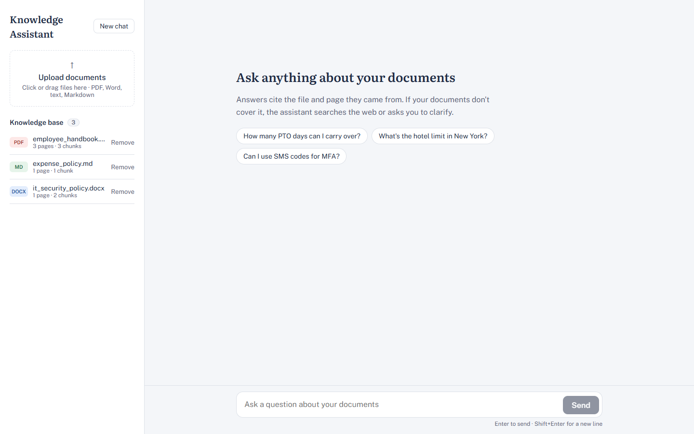
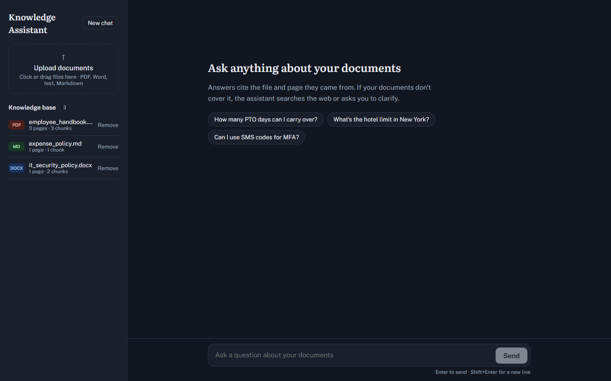
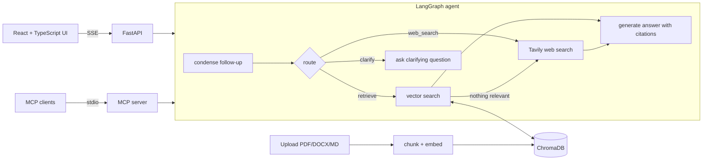

# Knowledge Assistant: chat with your company's documents

Upload policies, manuals, and reports, then ask questions in plain English. A **LangGraph agent** decides whether to search the knowledge base, search the web, or ask a clarifying question, and every answer **cites the exact file and page** it came from.

Built to drop into any domain: legal teams querying contracts, hospitals querying protocols, banks querying compliance docs, support teams querying knowledge bases. The demo ships with sample HR, IT security, and expense policies for a fictional company.



<details>
<summary>Dark mode</summary>


</details>

## Highlights

- **Agentic query routing (LangGraph):** an LLM router with structured output chooses `retrieve`, `web_search`, or `clarify`. If retrieval finds nothing above the relevance threshold, the agent falls back to the web automatically.
- **Grounded answers with citations:** numbered sources, inline `[n]` citations, and a UI that highlights the cited passage.
- **Conversation memory:** follow-ups ("what about contractors?") are rewritten into standalone questions; state is checkpointed per thread.
- **Streaming:** Server-Sent Events stream the route decision, sources, and answer tokens as they're produced.
- **Evals:** a labeled test set measuring route accuracy, retrieval hit rate, citation validity and correctness, answer accuracy, and optional LLM-as-judge faithfulness.
- **MCP server:** exposes the knowledge base as tools, so Claude Desktop, Cursor, or other agents can query it.
- **Multi-format ingestion:** PDF, Word, TXT, Markdown, with idempotent re-indexing.
- **Production habits:** typed Pydantic schemas, pluggable providers, offline test mode, 14 pytest tests, multi-stage Docker build.

## Architecture



## Project structure

```
backend/
  app/
    agent/        graph.py (LangGraph wiring), nodes.py, state.py, prompts.py
    ingest.py     loaders, chunking, vector store, search
    websearch.py  Tavily client
    main.py       FastAPI routes + SSE streaming
  mcp_server.py   MCP tools: list_documents, search_documents, ask_knowledge_base
  eval/           dataset.json + run_eval.py
  tests/          pytest suite (runs offline)
frontend/         React + TypeScript (Vite) chat UI
samples/          demo documents
```

## Run locally

**Backend**
```bash
cd backend
python -m venv .venv && source .venv/bin/activate     # Windows: .venv\Scripts\activate
pip install -r requirements-dev.txt
cp .env.example .env                                   # add OPENAI_API_KEY (and optionally TAVILY_API_KEY)
uvicorn app.main:app --reload
```

**Frontend** (new terminal)
```bash
cd frontend
npm install
npm run dev            # http://localhost:5173, proxies /api to the backend
```

Upload the files in `samples/` and try:
- "How many PTO days can I carry over?" (documents)
- "Can I fly premium economy on a 7 hour flight?" (documents)
- "What's the latest news on AI regulation?" (web)
- "policy?" (clarifying question)
- Ask "How much parental leave do birthing parents get?" then "And non-birthing parents?" (memory)

No API key? Set `LLM_PROVIDER=fake` to run the whole app offline with simulated answers.

**Docker** (single container serving API + UI)
```bash
docker build -t kb-assistant .
docker run -p 8000:8000 --env-file backend/.env kb-assistant     # http://localhost:8000
```

## Evaluation

```bash
cd backend
python -m eval.run_eval --ingest          # index samples, run the test set
python -m eval.run_eval --judge           # add LLM-as-judge faithfulness (1-5)
```

| Metric | What it checks |
|---|---|
| Route accuracy | Agent picked the expected route |
| Retrieval hit rate | Expected document was retrieved |
| Citation validity | Every `[n]` refers to a real source |
| Citation correctness | A citation points to the expected document |
| Answer accuracy | Answer contains the expected facts |
| Faithfulness | Claims are supported by the sources (LLM judge) |

Results are saved to `eval/results/` so you can compare runs before and after a change.

_Add your results table here after your first run._

## MCP server

Expose the knowledge base to any MCP client. For Claude Desktop, add to `claude_desktop_config.json`:

```json
{
  "mcpServers": {
    "company-knowledge-base": {
      "command": "/full/path/to/backend/.venv/bin/python",
      "args": ["/full/path/to/backend/mcp_server.py"],
      "env": { "OPENAI_API_KEY": "sk-...", "CHROMA_DIR": "/full/path/to/backend/data/chroma" }
    }
  }
}
```

Tools: `list_documents`, `search_documents(query, k)`, `ask_knowledge_base(question)`.

## API

| Method | Endpoint | Description |
|---|---|---|
| POST | `/api/documents` | Upload and index a file |
| GET | `/api/documents` | List indexed documents |
| DELETE | `/api/documents/{filename}` | Remove a document |
| POST | `/api/chat` | Ask a question (JSON) |
| POST | `/api/chat/stream` | Ask a question (SSE: `route`, `sources`, `token`, `done`) |

Interactive docs at http://localhost:8000/docs.

## Design decisions

- **Router before retrieval.** Avoids wasting a vector search (and confusing the answer model) on questions the documents can't answer, and lets the agent ask for clarification instead of guessing.
- **Relevance threshold + web fallback.** Low-scoring chunks are discarded rather than passed to the model, which reduces hallucinated answers built on irrelevant context.
- **Strict citation prompt.** The answer model may only cite numbers that exist; evals verify this.
- **Providers behind one module.** Swapping OpenAI for Azure OpenAI, Bedrock, or Ollama touches only `providers.py`.

## Roadmap

- Hybrid search (BM25 + vectors) and cross-encoder re-ranking
- Persistent checkpointer (Postgres) and per-user document permissions
- OCR for scanned PDFs
- LangSmith tracing for latency and token cost
